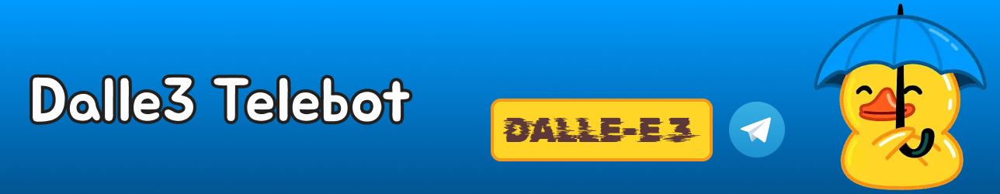
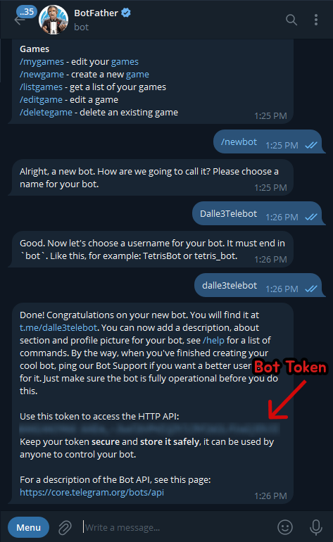
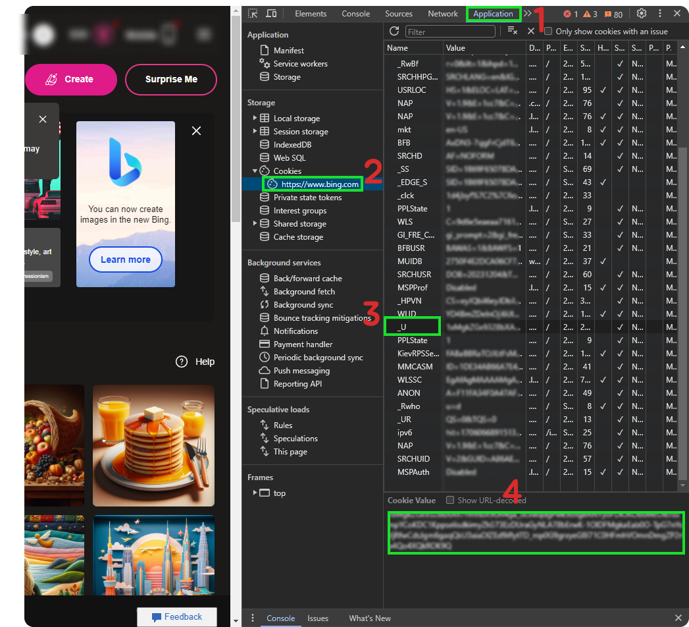
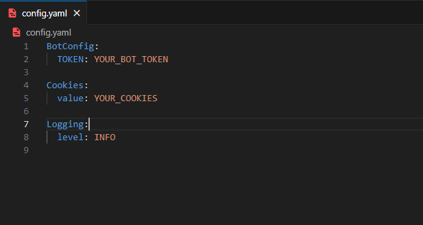
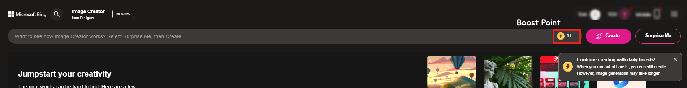

### DEMO


### GET BOT TOKEN
<div style="text-align:center">
    
</div>

### GET COOKIES
1. Go to https://bing.com/create
2. After you in Bing image Generation page click on generate without prompt or with prompt up to you.
3. Click F12 on that page to open developer tools.
4. Then `1`click on Application and go to cookies `2`then click on https://www.bing.com `3`now you will see _U click on it `4`then you will see your cookies under the page and copy it and paste it to config.yaml.


### SET UP PROJECT
```cmd
git clone https://github.com/xammal/Dalle3Telebot.git
```
>Go to project folder
```cmd
cd Dalle3Telebot
```
>Now install all lirbary that needed in requirements.txt
```cmd
pip install -r requirements.txt
```
>After install requirements library go to config.yaml file and replace YOUR_BOT_TOKEN with your actual bot token get from bot father and YOUR_COOKIES with your cookies value .<br>



>Now everyting is set up run the bot.
```cmd
python bot.py
```

> [!IMPORTANT]
> The Bot need boost point to generate image if you run out the boost point in bing generator the bot may fail request or take longer time to generate


